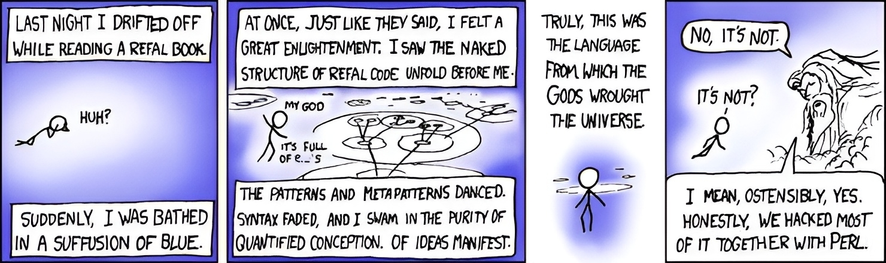

В качестве языка программирования на курс ФП я хотел бы выбрать Рефал.

## Актуальность для курса

Несмотря на то, что Рефал сильно отличается от других функциональных языков, он все еще позволяет освоить основные концепции ФП.
Весь язык строится на сопоставлении образцов (паттерн-матчинге).
Все алгоритмы в базисном рефале реализуются через рекурсию.
Он придерживается неизменяемости данных (хотя функции с сайд-эффектами есть и полностью чистым его назвать нельзя).
К тому же, я собираюсь использовать диалект Рефал-5λ, который расширяет Рефал, добавляя в него функции высшего порядка и безымянные функции, что позволяет реализовывать многие паттерны ФП.

Минусом для курса является нетипизированность Рефала (и алгорифмов Маркова в целом).
Поэтому концепции теории типов я планирую освоить, читая параллельно с прохождением курса ["Category Theory For Programmers"](https://github.com/hmemcpy/milewski-ctfp-pdf) Bartosz Milewski.

## Почему я решил выбрать именно Рефал

С функциональным программированием я знаком уже довольно хорошо знаком: у меня есть проекты на Elm, я пробовал писать на Ocaml, Haskell, Scala, я изучал лямбда-счисления, теорию типов и теорию категорий.
Ни чего из этого я полноценно не освоил, но тем не менее, я понимаю основные концепции ФП и могу писать на них.
Рефал же привлекает меня еще одним новым способом мыслить и смотреть на программы.

В своей области - обработке текстовых яыков - Рефал позволяет писать программы, на много интуитивнее и красивее, чем на других языках.

Рефал-машина заменяет активное выражение на месте и не накапливать результаты рекурсивных вызовов на стеке, что позволяет писать эффективные программы без использования хвостовой рекурсии (почему вообще мы должны учитывать эту особенность программатики в языках, строящихся на математической модели?).

Например:
```refal
ReplaceAWithB {
  'a' e.Rest = 'b' <Fab e.Rest>;
  s.Other e.Rest = s.Other <Fab e.Rest>;
  /* empty */ = /* empty */;
}
```

Рефал строится на R-выражениях, что позволяет делать паттерн-матчинг с неограниченным количеством открытых выражений. Если честно, после того, как я год назад посмотрел на Рефал, мне физически больно пользоваться паттерн-матчингом в других языках.

Например, простой парсер подмножества XML. Из этого кода сразу понятна структура XML-документа, нет необходимости в вспомогательных функциях:

```refal
ParseElem {
  e.Root = <Trim e.Root> : {
    '<' e.Tag '>' e.Content '</' e.Tag '>' e.Rest
      = (Element (e.Tag) <ParseElem e.Content>) <ParseElem e.Rest>;

    '<' e.Tag '>' e.Content '</' e.Tag '>'
      = (Element (e.Tag) <ParseElem e.Content>);

    e.Text
      = (Text e.Text);
  }
}
```

Мне также было бы интересно изучить тему Суперкомпиляции, которая тесно связана с Рефалом, так как этот язык стал полигоном для исследований в этой области.


## Skill issue или неудобство языка

Чтобы позже не столкнуться с тем, что язык (или я) не пригоден для написания программ, перед выбором я попробовал написать несколько программ на Рефал.

Я решил пару задачек с [Project Euler](https://github.com/butvinm/refal-euler) и [библиотеку для использования концепции генераторов](https://github.com/butvinm/refal-generators).

Выводы: на Рефал можно писать, пишется легко, отладка трудностей не доставляет (хотя формат трассировки очень специфичный, нужно привыкать).


## Инструменты

### Компилятор

Как я уже сказал, я собираюсь использовать диалект [Рефал-5λ](https://github.com/bmstu-iu9/refal-5-lambda). Этот проект поддерживался довольно долгое время, а сам компилятор превратился в песочницу для PHD, где люди защищают кандидатские работы на тему суперкомпиляции.
По опыту использования, проблем особо не возникло. Компилятор не самый дружелюбный, но рабочий.

### Линтеры, форматеры

Здесь грустно - их нет. Но есть [style guide](https://github.com/bmstu-iu9/refal-5-lambda/blob/master/doc/style-guide.md) в репозитории компилятора. Его, с небольшими корректировками, я и буду использовать.
В целом, у языка простой синтаксис и придерживаться стиля самостоятельно не составляет труда.
Возможно, я и сам напишу форматтер, благо есть библиотека для парсинга и преобразования программ на Рефал.

### Тесты

В рамках библиотеки для генераторов я также выработал подход к тестированию, можно посмотреть [здесь](https://github.com/butvinm/refal-generators/blob/master/tests/Test.ref).

Для 4 лабы хорошо подойдет Snapshot testing (golden tests, behavior tests). Подойдет [rere.py](https://github.com/tsoding/rere.py), хотя можно и на рефал мини-фреймворк написать.

## Что прочитал при подготовке

- Начал ["Лекции по языку программирования Рефал"](http://refal.botik.ru/library/refal2014_main_refal-2006.pdf) А. П. Немытых, их и планирую защищать на зачете
- Компьютерра "Рефал как язык для обработки xml-документов"
- Документацию по языку в репозитории компилятора

Основным источником информации по Рефал является документация и исходные коды компилятора Рефал-5λ. В них можно найти подробное описание как базисного Рефала, так и Рефал-5λ и много информации о работе Рефал-машины.
В коде компилятора можно так же подсматривать архитектурные и стилевые идеи.


## Идеи на 4 лабораторную

Рефал задумывался как метаязык для описания и преобразования других языков. Его синтаксис и семантика позволяют очень легко писать парсеры и делать текстовый преобразования.

Поэтому для 4 лабораторной я решил выбрать проект, максимально раскрывающий особенности языка - интерпретатор/компилятор языка [tula](https://github.com/tsoding/tula?tab=readme-ov-file).

tula - язык для описания Тьюринг-машины. Пример программ:

```tula
case Inc 0 1 -> Halt
case Inc 1 0 -> Inc

trace Inc { 1 1 0 1 }
```

```tula
for a b in Numbers
  case Swap (a b) (b a) -> Swap

case Swap & & -> Halt

trace Swap { (1 2) (2 3) (3 4) & }
```

Конечно, написание интерпретатора/компилятора довольно комплексная задача, но чтобы не застрять и не провалить сроки, фичи в язык можно добавлять постепенно.
Простейшую реализацию можно буквально за пару часов написать. К тому же я смотрел стримы по созданию этого языка и можно подсмотреть в оригинальную реализацию.

